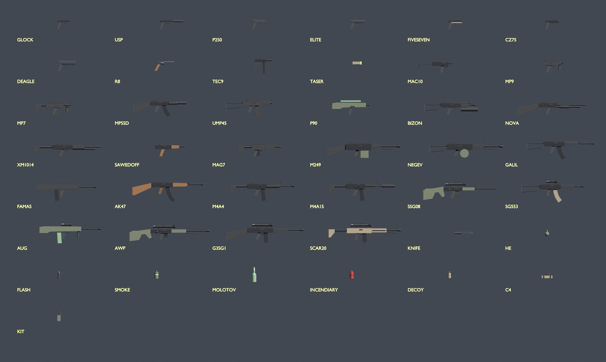
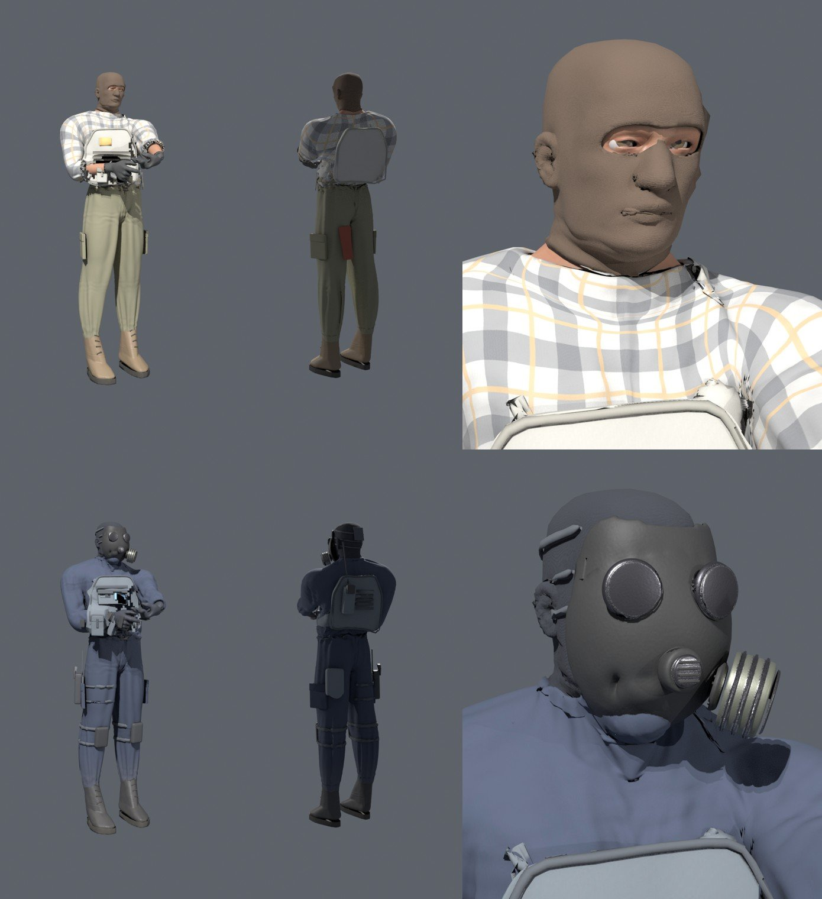

# VEXA

E-spora yönelik, rekabetçi 5v5 taktik FPS. Unity ile geliştiriliyor.

- **PC sürümü:** yüksek grafik kalitesi, 64/128 tick sunucular.
- **Mobil sürüm:** düşük poligon ama "küp küp" olmayan görünüm, dokunmatik kontroller.
- İki sürüm **aynı oyun kodunu** paylaşıyor ama **ayrı oyuncu havuzlarında** oynanıyor (çapraz platform yok).
- Turnuvalar [rally.gg](https://rallygg.com) üzerinden düzenlenecek.

> "VEXA" çalışma adıdır. Mağaza ve marka tescilinden önce isim araştırması yapılmalı.

## Depo yapısı

```
Game/                       Unity projesi (Unity 6, URP)
  Assets/Vexa/Core/         Oyun çekirdeği: saf C#, Unity'ye bağımlı değil (hareket, silahlar, hasar,
                            çarpışma, netcode, sunucu, istemci tahmini)
  Assets/Vexa/Net/          UDP taşıma (LiteNetLib)
  Assets/Vexa/Client/       Unity katmanı: giriş, kamera, oturum, dünya görselleri ve efektler
  Assets/Vexa/Client/UI/    Arayüz (UI Toolkit, koddan kurulur): menüler, HUD, radar, satın alma, skor, ayarlar
  Assets/Vexa/Resources/Fonts/  Barlow yazı tipleri (SIL Open Font License, OFL.txt)
  Assets/Vexa/Resources/Models/ Üretilmiş FBX modeller: Weapons, Characters, Arms (+ Mobile alt klasörleri)
  Assets/Vexa/Editor/       Harita dışa aktarma aracı (VEXA menüsü)
  Assets/StreamingAssets/Maps/  .vxmap çarpışma haritaları (sunucu + istemci ortak)
Server/Vexa.Server/         Bağımsız (headless) Linux/Windows sunucusu, Unity gerektirmez
Tests/Vexa.Tests/           Otomatik testler (hareket, silahlar, hasar, netcode, hile korumaları, maç kuralları, botlar)
Tools/                      Unity olmadan derleme kontrolleri; Tools/Blender: model üreticiler (silahlar, karakterler)
docs/                       Mimari ve yol haritası
archive/web-prototype/      Eski tarayıcı prototipi (referans için saklandı)
```

## Hızlı başlangıç

### 1) Testler (Unity gerekmez)
```bash
dotnet test Tests/Vexa.Tests
```

### 2) Sunucuyu çalıştır
```bash
# 5v5 rekabetçi maç; boş yerleri botlar doldurur, bağlanan oyuncular botların yerini alır
dotnet run --project Server/Vexa.Server -c Release -- --map kasaba --mode competitive --tick 128 --difficulty 0.6

# ölüm maçı, 6 botla
dotnet run --project Server/Vexa.Server -c Release -- --map training --mode deathmatch --bots 6
```
Modlar: `competitive`, `casual`, `deathmatch`, `practice`. `--difficulty` 0 (kolay) ile 1 (uzman) arasında.

**Turnuva maçı:** `--config maç.json` ile çalıştırılır. Dosyada takım isimleri, kadrolar, bıçak raundu, hazır olma, molalar, sonuç ve demo yolu bulunur. Örnek: `Server/Vexa.Server/Examples/tournament-match.json`.
- Oyuncular sohbete `.ready`, `.stay` / `.switch`, `.tac`, `.tech`, `.unpause` yazar (Esc menüsünde düğme olarak da var).
- Sunucu konsolunda `help` yazınca yönetici komutları listelenir.
- Maç bitince sonuç JSON'u yazılır. rally.gg API'si gelince bu dosya oraya gönderilecek.

**Demo kaydı:** `--record maç.vxdemo`. Kayıtlar oyunda **DEMOLAR** menüsünden izlenir. Kendi kurduğun maçlar için o menüde "MAÇLARIMI KAYDET"i aç.

### 3) Unity'de aç
1. Unity Hub ile **Unity 6 LTS** (6000.0.x) kur. Mobil için Android/iOS modüllerini de ekle.
2. Unity Hub → **Add project from disk** → `Game` klasörünü seç. İlk açılışta paketler indirilir; farklı bir 6000.0 sürümün varsa yükseltmeyi kabul et.
3. **Edit → Project Settings → Player → Active Input Handling = Both**.
4. Proje URP grafik ayarı istemezse: *Assets → Create → Rendering → URP Asset (with Universal Renderer)*. Sonra *Project Settings → Graphics* ve *Quality* bölümlerinde bu asset'i seç.
5. Oyuncu derlemesi (build) alırken *Project Settings → Graphics → Always Included Shaders* listesine **Universal Render Pipeline/Lit** ve **Universal Render Pipeline/Unlit**'i ekle; malzemeler koddan oluşturulduğu için Unity bunları kendiliğinden dahil etmez.
6. Herhangi bir sahnede (boş sahne de olur) **Play**'e bas. VEXA ana menüsü kendiliğinden açılır.
7. **OYNA** sekmesinde modu, haritayı, tarafı ve bot zorluğunu seç, ardından **MAÇI BAŞLAT**'a bas. Aynı sayfadaki **SUNUCUYA KATIL** bölümü 2. adımdaki sunucuya bağlanır.

**Kontroller (PC):**

| Tuş | İşlev |
|---|---|
| WASD | Hareket |
| Fare | Bakış / ateş (sağ tık: dürbün, susturucu, ikincil atış) |
| Shift | Sessiz yürü |
| Ctrl veya C | Eğil |
| Boşluk | Zıpla |
| R | Şarjör değiştir |
| 1 / 2 / 3 | Birincil / ikincil / bıçak |
| 4 | El bombaları (tekrar basınca sıradaki) |
| 5 | C4 (bomba bölgesinde sol tık basılı tutunca kurulur) |
| E | Silah al / bombayı imha et (basılı tut) |
| G | Silahı bırak |
| Q | Son silah |
| B | Satın alma menüsü (1–6 sütun, ardından ürün numarası) |
| Tab | Skor tablosu |
| M | Takım değiştir |
| Y / U | Sohbet: herkes / takım |
| Esc | Menü |

Tüm tuşlar **Ayarlar → Tuşlar** ekranından değiştirilebilir. Ölünce sol/sağ tık ile takım arkadaşları arasında geçiş yapılır, Boşluk ile kamera değişir.
Demo izlerken: Boşluk duraklat, ↑/↓ hız, PgUp/PgDn raund, ←/→ oyuncu, C kamera.

**Mobil:** sol yarıda joystick, sağ yarıda sürükleyerek bakış, ekran butonları; üstte MENÜ / SATIN AL / SKOR.

> Not: Bu repo, Unity'nin kurulu olmadığı bir ortamda geliştiriliyor. Çekirdek kod otomatik testlerle doğrulanıyor. Unity scriptleri de Unity referans kütüphanelerine karşı derleniyor. Unity'de ilk açılışta bir derleme hatası çıkarsa Console çıktısını paylaşman yeterli.

## Durum

Mevcut kilometre taşı: rekabetçi oynanış, arayüz, gerçekçi karakterler (4K doku, kıyafet fiziği) ve detaylı silah modelleri, sohbet, izleyici, demo ve turnuva modu. Sırada: rally.gg API entegrasyonu (API bilgisi bekleniyor), haritaların sanat geçişi ve ses paketi.


 Ayrıntılar için [docs/ROADMAP.md](docs/ROADMAP.md) ve [docs/ARCHITECTURE.md](docs/ARCHITECTURE.md).
